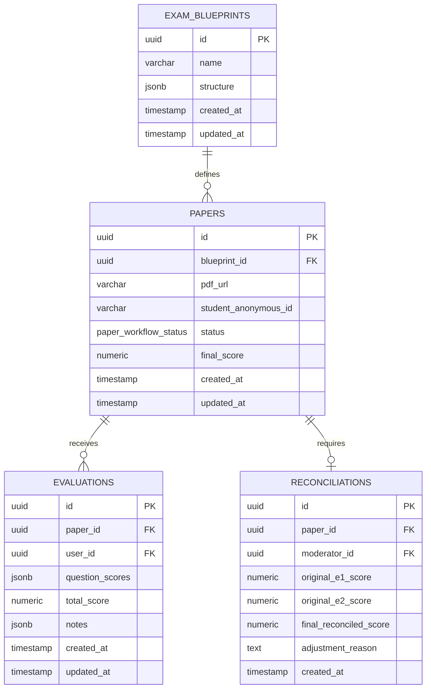

# System Architecture - ExamVal

## 1. Database Schema Design (PostgreSQL / Supabase)

We employ a relational schema structured to guarantee data integrity, double-blind encapsulation, and verifiable audit trails. 



---

## 2. Enums and Types

### 2.1 `user_role`
Determines access privileges and visibility across application routes.
```sql
CREATE TYPE user_role AS ENUM ('Evaluator', 'Moderator');
```

### 2.2 `paper_workflow_status`
Tracks the lifecycle of an exam paper script.
```sql
CREATE TYPE paper_workflow_status AS ENUM (
  'Pending_E1_E2',        -- Awaiting grading submissions from both independent evaluators
  'Needs_Reconciliation', -- Flagged due to score variance >= 5 points between E1 and E2
  'Completed'             -- Grading finalized (averaged or reconciled by moderator)
);
```

---

## 3. Database Tables Definition

### 3.1 `exam_blueprints`
Stores the structured blueprint configuration of an exam, declaring sections, questions, maximum obtainable scores, and passing criteria.
```sql
CREATE TABLE exam_blueprints (
  id UUID PRIMARY KEY DEFAULT gen_random_uuid(),
  name VARCHAR(255) NOT NULL,
  structure JSONB NOT NULL, -- JSON Schema representing questions, e.g., [{"id": "q1", "max_score": 10}, ...]
  created_at TIMESTAMP WITH TIME ZONE DEFAULT timezone('utc'::text, now()) NOT NULL,
  updated_at TIMESTAMP WITH TIME ZONE DEFAULT timezone('utc'::text, now()) NOT NULL
);
```

### 3.2 `papers`
Contains metadata about individual student exam paper script uploads.
```sql
CREATE TABLE papers (
  id UUID PRIMARY KEY DEFAULT gen_random_uuid(),
  blueprint_id UUID REFERENCES exam_blueprints(id) ON DELETE RESTRICT NOT NULL,
  pdf_url VARCHAR(2048) NOT NULL,
  student_anonymous_id VARCHAR(100) UNIQUE NOT NULL,
  status paper_workflow_status DEFAULT 'Pending_E1_E2'::paper_workflow_status NOT NULL,
  final_score NUMERIC(5, 2) DEFAULT NULL, -- Populated either by average trigger or moderator override
  created_at TIMESTAMP WITH TIME ZONE DEFAULT timezone('utc'::text, now()) NOT NULL,
  updated_at TIMESTAMP WITH TIME ZONE DEFAULT timezone('utc'::text, now()) NOT NULL
);
```

### 3.3 `evaluations`
Stores evaluations submitted by individual evaluators.
```sql
CREATE TABLE evaluations (
  id UUID PRIMARY KEY DEFAULT gen_random_uuid(),
  paper_id UUID REFERENCES papers(id) ON DELETE CASCADE NOT NULL,
  user_id UUID NOT NULL, -- Maps to Supabase auth.users
  question_scores JSONB NOT NULL, -- Key-value map of answers: {"q1": 8.5, "q2": 4.0}
  total_score NUMERIC(5, 2) NOT NULL, -- Redundant sum calculated during insert/update for indexing and trigger speed
  notes JSONB, -- Optional/mandatory textual feedback for questions: {"q1": "Needs cleaner proof"}
  created_at TIMESTAMP WITH TIME ZONE DEFAULT timezone('utc'::text, now()) NOT NULL,
  updated_at TIMESTAMP WITH TIME ZONE DEFAULT timezone('utc'::text, now()) NOT NULL,
  
  -- Strict Double-Blind constraint: One evaluator can submit only one review per paper
  CONSTRAINT unique_paper_user_evaluation UNIQUE (paper_id, user_id)
);
```

### 3.4 `reconciliations`
Logs audit trails of moderator interventions on papers flagged with variance errors.
```sql
CREATE TABLE reconciliations (
  id UUID PRIMARY KEY DEFAULT gen_random_uuid(),
  paper_id UUID REFERENCES papers(id) ON DELETE CASCADE UNIQUE NOT NULL,
  moderator_id UUID NOT NULL, -- Maps to Supabase auth.users
  original_e1_score NUMERIC(5, 2) NOT NULL,
  original_e2_score NUMERIC(5, 2) NOT NULL,
  final_reconciled_score NUMERIC(5, 2) NOT NULL,
  adjustment_reason TEXT NOT NULL,
  created_at TIMESTAMP WITH TIME ZONE DEFAULT timezone('utc'::text, now()) NOT NULL
);
```

---

## 4. Trigger Business Logic (Database-Side Rules)

All variance checking and status transitions must happen server-side to guarantee system integrity and prevent client-side race conditions.

### 4.1 Trigger Requirement: `check_evaluations_variance`
- **Execution**: Triggered `AFTER INSERT OR UPDATE` on the `evaluations` table.
- **Algorithm**:
  1. Retrieve all evaluations associated with the target `paper_id`.
  2. If the count of evaluations is less than 2:
     - Keep the paper's status as `Pending_E1_E2`.
     - Exit trigger.
  3. If the count of evaluations is exactly 2:
     - Fetch `total_score` of both evaluations (let them be $S_1$ and $S_2$).
     - Calculate $\Delta = | S_1 - S_2 |$.
     - If $\Delta \ge 5.00$:
       - Update `papers` table where `id = paper_id` setting `status = 'Needs_Reconciliation'`.
     - If $\Delta < 5.00$:
       - Calculate $S_{avg} = \frac{S_1 + S_2}{2.0}$.
       - Update `papers` table where `id = paper_id` setting `status = 'Completed'` and `final_score = S_avg`.
  4. If the count of evaluations exceeds 2:
     - Raise an exception (invalid workflow state: only two evaluations are permitted per paper).

### 4.2 Security and Row-Level Security (RLS)
1. **Blind Policy on `evaluations`**: 
   - Users with role `Evaluator` can only select evaluations where `user_id = auth.uid()`. They are completely restricted from querying records submitted by other users.
   - Users with role `Moderator` can read all evaluations.
2. **Read Policy on `papers`**:
   - Evaluators and Moderators can read all papers.
3. **Write Policy on `reconciliations`**:
   - Only users with role `Moderator` can insert records.
