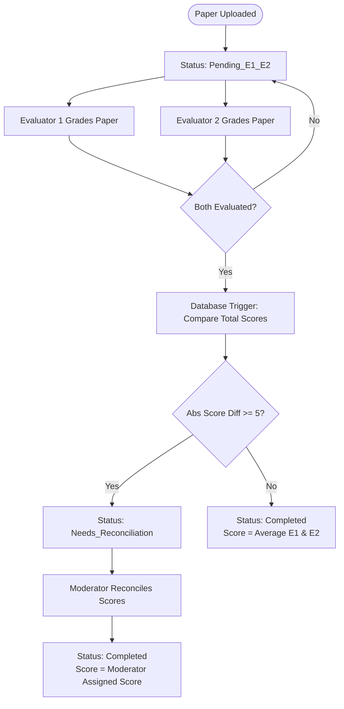

# Product Requirement Document (PRD) - ExamVal

## 1. Executive Summary
ExamVal is a high-stakes, double-blind PDF evaluation and reconciliation workflow system designed for educational institutions and certification bodies. The platform ensures grading integrity and fairness by routing exam papers through a strict, multi-stage evaluation pipeline. 

Two independent evaluators (E1 and E2) grade each candidate's exam paper blind to each other's marks. A database-driven trigger detects scoring discrepancies (variance >= 5 points) and routes anomalous papers to a Moderator Triage Queue for reconciliation. If the score difference is within acceptable bounds (< 5 points), the system automatically averages the grades and marks the evaluation as complete.

---

## 2. Core Workflow & Business Logic

### 2.1 Double-Blind Grading Rules
1. **Blind Workspace**: Evaluators must have zero visibility of other evaluations. An evaluator cannot view the scores, notes, or identity of the other evaluator (E1 cannot see E2's marks, and vice versa).
2. **Strict Identity Anonymization**: Student papers are anonymized via a `student_anonymous_id`. Under no circumstances should student names or actual IDs be exposed to evaluators.
3. **Double Submission Block**: A single evaluator can only submit one evaluation per paper. The combination of `paper_id` and `user_id` is unique.

### 2.2 Score Processing and Variance Resolution
Once **both** E1 and E2 submit their grades for a paper, the following rules apply (computed server-side/database-side via trigger):
- Let $S_{E1}$ be the total score submitted by Evaluator 1.
- Let $S_{E2}$ be the total score submitted by Evaluator 2.
- Let $\Delta = | S_{E1} - S_{E2} |$ be the score variance.

- **Condition A (Passes Variance)**: If $\Delta < 5$ points:
  - The final score for the paper is calculated as $S_{final} = \frac{S_{E1} + S_{E2}}{2}$.
  - The workflow status of the paper is updated to `Completed`.
- **Condition B (Fails Variance)**: If $\Delta \ge 5$ points:
  - The workflow status of the paper is updated to `Needs_Reconciliation`.
  - The paper is routed to the **Moderator Triage Queue**.
  - A moderator must manually review the discrepancy and assign a resolved final score, moving the paper's status to `Completed`.

---

## 3. Detailed View Specifications

### 3.1 Evaluator Workspace Split-Screen
- **Left Panel**: Interactive PDF viewer rendering the digital exam script. Supports page navigation, zooming, and persistent highlights.
- **Right Panel**: Grading Form dynamically generated from the exam blueprint.
  - Form fields map directly to blueprint schema (e.g., Q1, Q2a, Q2b, Q3).
  - Validation: Input values must be within the maximum allowable points configured per question.
  - Feedback: Inline error validation highlighting out-of-bounds scores.
  - Submit Action: Disabled until all questions are scored and notes are filled (if marked mandatory). Once submitted, the form becomes read-only to prevent tampering.

### 3.2 Moderator Triage Dashboard
- **Analytics Cards**: High-level counters for total papers, pending evaluations, papers needing reconciliation, and completed papers.
- **Triage Queue Table**:
  - Lists all papers with status `Needs_Reconciliation`.
  - Shows `student_anonymous_id`, `Score E1`, `Score E2`, calculated `variance`, and `last updated time`.
  - Sortable and filterable by variance size, blueprint type, and date.
  - Action column containing a prominent "Reconcile" link leading to the Reconciliation Matrix Table.

### 3.3 Moderator Reconciliation Matrix Table
- **Side-by-Side Comparison**: Column-based grid showing:
  - **Column 1**: Question item/sub-item names as defined by the exam blueprint.
  - **Column 2**: Scores and justification notes submitted by Evaluator 1 (E1).
  - **Column 3**: Scores and justification notes submitted by Evaluator 2 (E2).
  - **Column 4**: The delta (variance) highlighted in red if $\ge 5$ at individual question level or overall.
  - **Column 5**: Interactive input fields for the Moderator to override/set the reconciled score and write audit trail justification notes.
- **Submission Guardrail**: The moderator's final score submission requires a justification note before the status changes to `Completed`. All overrides must be logged in the `reconciliations` audit trail.
